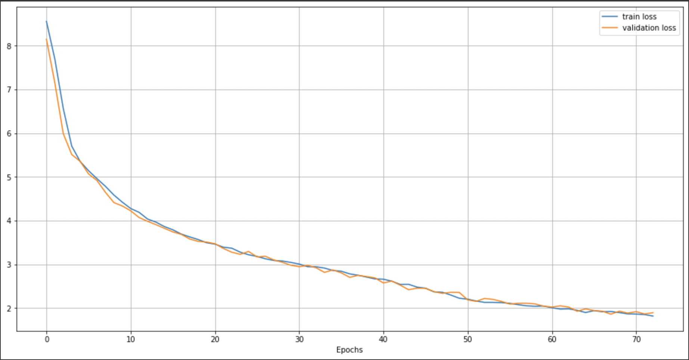

# Translation task with Transformer
Implementation from sratch of the Transformer with Tensorflow and application to English to French translation.

References:
- [Attention is all you need](https://arxiv.org/pdf/1706.03762.pdf)
- [Beam Decoding with Controlled Patience](https://arxiv.org/pdf/2204.05424.pdf)



## Config
Go to the project directory:
````
cd <project-directory>
````
Create a new Python environment:
````
python -m venv <env-name>
````
Set up the project:
````
python setup.py <env-name>
````
Activate the project environment:
````
source <env-name>/bin/activate
````

Install dependencies:
````
pip install -r requirements.txt
````

## Quick start

To quickly try the model write some English text in ``input.txt`` and execute the follow instruction in command line:
````
python translate.py --input_file="input.txt" --output_file="output.txt"
````

## Training/Finetuning
It is possible to train the model yourself or train your own custom model or perform some finetuning.

A boilerplate script for both training and finetuning is available: ``train.py``.
It's up to you if you want to customize it. But by default any time you want to train or finetune a model, you need to prepare the dataset on which you want to train. But for the dataset on which the default has been trained, everything has been prepared for you. Just excute data preration script:

````
python datasets/en_fr/prepare.py
````

This script will generate two files in the same folder: ``train_data`` and ``val_data``. These are just saved [tensorflow.data.Dataset](https://www.tensorflow.org/api_docs/python/tf/data/Dataset) objects.

After preparing the dataset you just need to execute the ``train.py`` script.

To train the default model:
````
python train.py --data_dir=<data_dir> --out_dir=<out_dir>
````
> * ``<data_dir>`` is a placeholder for the actual directory path of the dataset. Where ``train_data`` and ``val_data`` can be found.
> * ``<out_dir>`` is placeholder for the path directory where the trained weights are going to be stored.

The [Transformer](https://arxiv.org/pdf/1706.03762.pdf) as defined in this project has some parameters:
* ``d_model`` the main dimension of the model. Used for embedding dimension and context vectors dimension
* ``vocab_size`` the size of the vocabulary
* ``num_heads`` the number of attention heads
* ``num_layers`` the number of **Encoder** and **Decoder** blocs
* ``expansion`` the factor by which to expand to number of neurons on the hidden layer of the feed-forwad network in the **EncoderBloc** and **DecoderBloc** with respect to ```d_model`.

Default values have been set for those parameters. If you want to train a custom **Transformer** with other values then you have to specify them in command line in the same way as ``data_dir`` and ``out_dir``. No need to specify all of them, just those you want to change.
For instance if I just want to change ``d_model`` and ``num_heads``:
````
python train.py --data_dir=<data_dir> --out_dir=<out_dir> --d_model=<d_model> --num_heads=<num_heads>
````

## Translating
Translating with the default model has already been explained above. After training your own model, If you want to watch it in action, you just need to execute the following instruction:
````
python translate.py model_configs/<model_config> --input_file=<input_file> --output_file=<output_file>
````
> You have noticed that something new appeared.
> Indeed, after training your own model with your own parameters, you need to create a configuration file where you specify your parameter values following [example.py](model_configs/example.py) template in ``model_configs`` directory.
> Then you have to give the name of your configuration file in place of ``<model_config>`` so that the correct architecture of the custom model is used.


